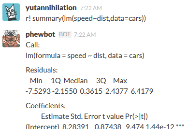

A Docker Image for hubot that can talk R (a.k.a. mecamonagi)
========================================

**Note that the heart of this hubot is made by @teramonagi. Thanks for your great work!**

## Pull

hubot-rserve Docker image is now on Docker Hub: https://registry.hub.docker.com/u/yutannihilation/hubot-rserve/

```sh
docker pull yutannihilation/hubot-rserve
```

## Run

### 1. Configure Hubot Integration

You can configure the intagration here: https://YOURTEAM.slack.com/services/new/hubot

You will find "API Token", which you will use on the next step.

### 2. Run Docker Container

In addition to a Slack Hubot API token, you need an Slack Web API tokan to upload images. (bot cannot use file upload API)

```sh
docker run -d \
  -e HUBOT_SLACK_TOKEN=XXXXXXXXXX \
  -e SLACK_WEB_API_TOKEN=YYYYYYYYY \
  yutannihilation/hubot-rserve
```

### 3. Talk To Hubot

This hubot can execute arbitrary R scripts like this:

```sh
r! summary(lm(speed~dist,data=cars)) 
```

The hubot answers immediately like this:




#### Available Commands

##### Exec Script

```
r! COMMAND
```

##### Plot

```
plot! COMMAND
```

##### Get Weather Forecast

```
weather! LOCATION
```

## Development

```sh
docker run --user=root -t -i yutannihilation/hubot-rserve /bin/bash

# Inside the hubot-rserve container ----------------
# customize the heart of mecamonagi
vi scripts/mecamonagi.coffee

# add some script
vi scripts/some-awesome-script.coffee

# run Rserve
R CMD Rserve --vanilla

# run hubot
HUBOT_SLACK_TOKEN=XXXXXXXXXX SLACK_WEB_API_TOKEN=YYYYYYYY bin/hubot -a slack
```
